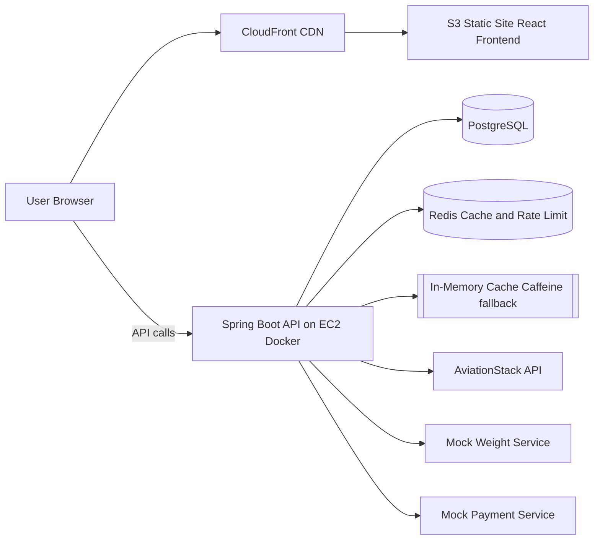
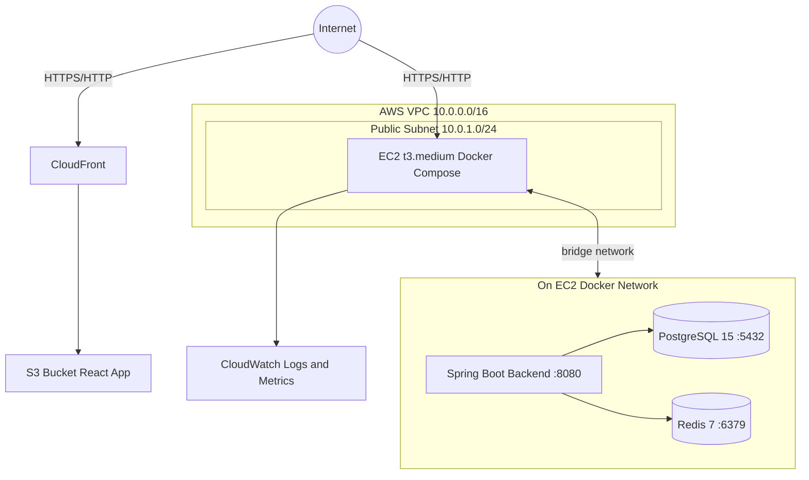
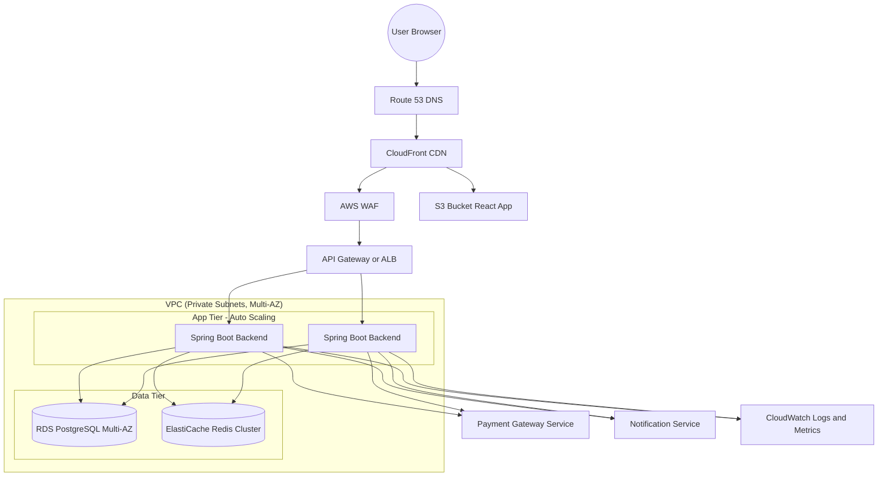
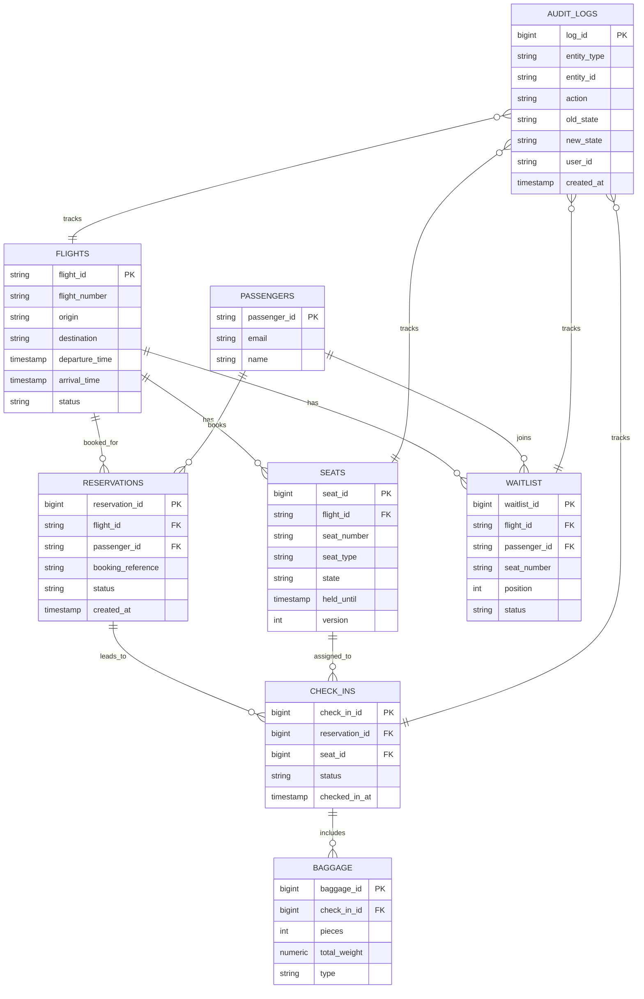

## SkyHigh Core – Architecture

### 1. Overview & Goals
- **Purpose**: Digital check-in system for SkyHigh flights (seat selection, baggage, waitlist, payment confirmation).
- **Goals**: Simple MVP deployment, strong data consistency for seats/check-ins, secure auth, and clear path to scale.

### 2. High-Level Architecture
- **Frontend**: React + TypeScript SPA served from S3 via CloudFront.
- **Backend**: Spring Boot REST API on EC2 (Docker), encapsulating business logic and integrations.
- **Database**: PostgreSQL (single instance in Docker) as system of record.
- **Cache**: Redis (Docker) for seat map cache, rate limiting/abuse detection, and optional distributed lock; in-memory Caffeine as fallback when Redis is unavailable.
- **External services**: AviationStack (flight status), mock services for weight and payment.

### 3. Infrastructure Architecture
- **Compute**: Single EC2 (t3.medium) in a public subnet, running Docker Compose (backend + PostgreSQL + Redis).
- **Network & security**: VPC with one public subnet; security group allowing HTTP/HTTPS/SSH; DB and Redis not exposed publicly (only Docker bridge network).
- **Storage & monitoring**: EBS for EC2, S3 for frontend, CloudWatch for logs/metrics.

#### 3.1 Infra Diagram

#### 3.2 Production-Grade Infra (Future State)

- **Edge & routing**: Route 53 (DNS), CloudFront CDN, AWS WAF in front of APIs.
- **API layer**: API Gateway or Application Load Balancer terminating TLS and routing to multiple backend instances.
- **Auth**: Amazon Cognito (or external IdP) issuing JWTs that the backend validates.
- **Compute**: Auto Scaling Group of EC2 instances (or ECS/Fargate) across multiple AZs.
- **Data**: RDS PostgreSQL (multi-AZ), ElastiCache Redis for cache, rate limiting, and distributed seat locks.
- **External integrations**: Payment gateway provider, notification provider for email and SMS, flight status API.
- **Security & secrets**: Private subnets for app/data, security groups, Secrets Manager or Parameter Store for credentials.
- **Observability**: CloudWatch logs and metrics, X-Ray tracing, central log bucket.

### 4. Application Components
- **Controllers**: HTTP API for auth, flights, seats, check-in, baggage, waitlist, payments.
- **Services**: Business workflows and domain services (seat hold or confirm or cancel, check-in life cycle, waitlist promotion, payment service, notification service).
- **Repositories**: Spring Data JPA for all core entities.
- **Cross-cutting**: Caching (Redis for seat maps and optional Caffeine fallback), rate limiting/abuse detection (Redis), scheduling (seat expiration), validation, global exception handling, audit logging.

### 5. Data Architecture & ERD
- **Design**: Relational, normalized schema with explicit state columns and audit trail.
- **Key entities**:
  - `flights`: Flight metadata and schedule.
  - `passengers`: Passenger identity and contact info.
  - `reservations`: Passenger–flight association (booking/trip), independent of check-in.
  - `seats`: Seat inventory with state and optimistic locking.
  - `check_ins`: Per-passenger per-flight check-in record.
  - `baggage`: Baggage items linked to check-ins.
  - `waitlist`: Waitlisted passengers for specific flight/seat (or class).
  - `audit_logs`: Change history for critical entities.

#### 5.1 ERD Diagram (Core)

### 6. Domain & State Models
- **Seat state**: `AVAILABLE → HELD → CONFIRMED → CANCELLED`, with HELD auto-expiring via scheduler.
- **Check-in state**: e.g., `PENDING → COMPLETED → CANCELLED`.
- **Waitlist state**: positions per flight/seat, promotion when seats become available.

### 7. Concurrency, Consistency & Caching
- **Concurrency**: Optimistic locking on seats; conflicts result in explicit seat conflict errors. Optional Redis-based distributed lock per seat when running multiple backend instances.
- **Consistency**: Seat state transitions and check-in operations run in single DB transactions.
- **Caching**: Redis for seat map cache (P95 &lt; 1s, high concurrency); short TTL and invalidation on seat state changes. Caffeine in-memory as fallback when Redis is unavailable. Redis also used for rate limiting and abuse/bot detection (e.g. seat map access throttling and temporary block).

### 8. Security & Authentication
- **Auth**: JWT-based stateless authentication; Spring Security filters protect all API routes except login/health.
- **Data protection**: HTTPS via CloudFront/ACM, encrypted EBS/S3, no direct DB exposure.
- **Access model**: Passenger-level access; future extension to staff/admin roles.

### 9. Availability, Scalability & Performance
- **MVP**: Single EC2 instance, vertical scaling only; Redis in Docker for cache and rate limiting.
- **Scale-out path**: Move DB to RDS, add ALB, Redis (ElastiCache or container), multiple backend instances with optional Redis-based seat lock.
- **Performance**: Redis seat map cache for sub-second P95 and hundreds of concurrent users; indexed DB queries on critical paths (seat availability, check-in lookup, waitlist); pagination for lists.

### 10. Observability & Operations
- **Health & metrics**: Spring Actuator endpoints, container health checks, EC2 and application metrics in CloudWatch.
- **Logging**: Structured application logs shipped to CloudWatch; key events (state changes) also in `audit_logs`.
- **Failure handling**: Timeouts/circuit breakers around external APIs; clear error responses to frontend.

### 11. Deployment & Environments
- **Local**: Docker Compose for backend + PostgreSQL + Redis; frontend via dev server. Redis optional for local runs (backend degrades to DB + in-memory when Redis is absent).
- **Prod**: Built images deployed to EC2 via Docker Compose; frontend built artifacts synced to S3 and served via CloudFront. Redis container (or ElastiCache) for cache and rate limiting.
- **Database migrations**: Flyway runs on backend startup, versioning schema changes.

### 12. Key Architectural Decisions
- **Single EC2 + Docker** for MVP (cost and simplicity) with clear path to RDS/ALB when needed.
- **PostgreSQL** as single source of truth with strong constraints and audit logs.
- **Redis** for seat map cache (P95 &lt; 1s), rate limiting/abuse detection, and optional distributed seat lock; Caffeine fallback when Redis is unavailable.
- **JWT auth** for a simple, stateless security model suitable for SPA + API.

