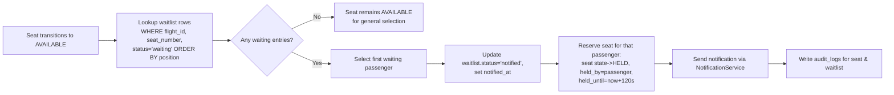
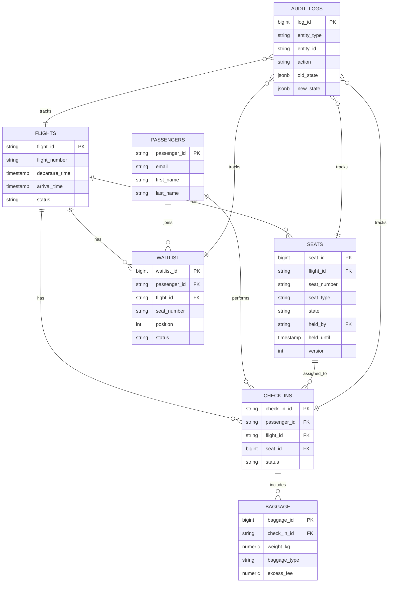

## Workflow Design

This document explains how the SkyHigh Core backend implements the main business workflows: seat reservation, check‑in (including baggage and payment), waitlist promotion, and seat hold expiration. It also summarizes how the database schema supports these flows and how state history is recorded.

---

## 1. Workflow Overview

- **Seat reservation & hold**: Passenger selects a seat, which transitions from `AVAILABLE` to `HELD` with a 120‑second server‑side timer enforced via DB fields and a scheduler.
- **Check‑in with baggage & payment**: Passenger completes check‑in, adds baggage, optionally pays excess fees, and the seat transitions to `CONFIRMED`.
- **Waitlist management**: When preferred seats are not available, passengers join a FIFO waitlist; when a seat becomes available, the next in line is promoted and given a 120‑second hold.
- **Seat hold expiration**: A scheduler periodically releases expired holds back to `AVAILABLE` and triggers downstream effects such as waitlist promotion and seat map cache invalidation.

The backend enforces consistency using:
- **Relational constraints** in PostgreSQL (foreign keys, unique constraints, check constraints).
- **Optimistic locking** on `seats` via a `version` column.
- **Audit logs** capturing before/after state of critical entities.

---

## 2. Seat Reservation & Hold Workflow

### 2.1 Happy Path Flow

When a passenger views a seat map and reserves a seat, the flow is:

```mermaid
flowchart LR
    A[Passenger opens seat map] --> B[GET /flights/{flightId}/seat-map]
    B --> C[Backend loads from Redis or DB]
    C --> D[Passenger selects seat]
    D --> E[POST /flights/{flightId}/seats/{seatNumber}/reserve]
    E --> F[Read Seat row for flightId+seatNumber]
    F --> G{state == AVAILABLE<br/>and version matches?}
    G -- No --> H[Return 409 CONFLICT (SeatConflict)]
    G -- Yes --> I[Update state->HELD,<br/>held_by, held_until=now+120s,<br/>version++ in single TX]
    I --> J[Write audit_log entry]
    J --> K[Invalidate seat-map cache for flight]
    K --> L[Return 200 with expiresAt & remainingSeconds]
```

### 2.2 Concurrency Handling

- `seats` table columns involved:
  - `state` (`AVAILABLE|HELD|CONFIRMED|CANCELLED`)
  - `held_by`, `held_until`
  - `version` (optimistic locking)
- The reservation `UPDATE` includes both `seat_id` and `version` in the `WHERE` clause. If **0 rows are updated**, another concurrent request won the race, and the API returns **409 Conflict**.
- The `unique_flight_seat` index (`flight_id`, `seat_number`) plus `chk_seat_state` and `version` ensure that:
  - One logical winner exists per race.
  - Seat state machine rules are preserved.

---

## 3. Check‑In, Baggage & Payment Workflow

### 3.1 End‑to‑End Check‑In Flow

This flow assumes the passenger has a booking and is authenticated.

```mermaid
flowchart LR
    A[Passenger starts check-in] --> B[GET /flights/{flightId}/seat-map]
    B --> C[Reserve Seat (Section 2)]
    C --> D[Create check_ins row<br/>status='pending']
    D --> E[Passenger adds baggage<br/>POST /check-ins/{id}/baggage]
    E --> F[Validate weight & compute fees]
    F --> G{Excess fee required?}
    G -- No --> H[Update check_ins.status='baggage_added']
    H --> I[POST /check-ins/{id}/confirm]
    I --> J[Transition seat HELD->CONFIRMED,<br/>update check_ins.status='completed']
    J --> K[Issue boarding pass data]
    G -- Yes --> L[Update baggage rows with<br/>excess_weight_kg & excess_fee,<br/>set payment_status='pending']
    L --> M[POST /check-ins/{id}/payment]
    M --> N{Payment success?}
    N -- No --> O[Keep seat HELD while timer active,<br/>allow retry or cancel]
    N -- Yes --> P[Set baggage.payment_status='paid',<br/>update check_ins.status='payment_completed']
    P --> I
```

### 3.2 Database Involvement

- **`check_ins`** captures the lifecycle:
  - `status`: `pending | baggage_added | payment_completed | completed | cancelled`
  - `check_in_time`, `completed_at`, `cancelled_at`
  - Foreign keys to `passengers`, `flights`, and `seats`.
- **`baggage`** is 1‑to‑many with `check_ins`:
  - Stores `weight_kg`, `baggage_type`, `excess_weight_kg`, `excess_fee`.
  - `payment_status`: `pending | paid | failed | refunded`.
- **`seats`**:
  - Remains in `HELD` during baggage/payment.
  - Transitions to `CONFIRMED` only when check‑in is finalized.
- All critical transitions (seat state, check‑in status, baggage payment changes) are logged to `audit_logs`.

### 3.3 Cancellation Flow

- When a passenger cancels via `POST /check-ins/{id}/cancel`:
  - In a single transaction:
    - `check_ins.status` → `cancelled`, `cancelled_at` set.
    - If seat was `CONFIRMED`, `seats.state` → `AVAILABLE`, and `confirmed_by` cleared.
  - A corresponding `audit_logs` entry is inserted.
  - If a waitlist exists for that flight/seat, the **waitlist promotion workflow** (below) is triggered.

---

## 4. Waitlist Management Workflow

### 4.1 Joining and Leaving the Waitlist

- When a seat (or seat number preference) is **not available**:
  - `POST /flights/{flightId}/seats/{seatNumber}/waitlist` inserts a row into `waitlist` with:
    - `flight_id`, `seat_number`, `passenger_id`.
    - `position` (FIFO ordering per flight/seat).
    - `status = 'waiting'`, `joined_at` timestamp.
- Leaving the waitlist:
  - `DELETE /waitlist/{waitlistId}` marks `status = 'cancelled'` and retains the row for auditability.

### 4.2 Promotion Flow When a Seat Becomes Available

Promotion can be triggered by:
- Seat cancellation.
- Seat hold expiration.
- Manual admin actions (if any).



If the **notified passenger** does not complete check‑in before `held_until`, the standard **seat hold expiration workflow** runs again, moving on to the next waitlisted passenger or exposing the seat to the general pool.

---

## 5. Seat Hold Expiration & Scheduler Workflow

### 5.1 Scheduled Release Job

- A Spring `@Scheduled` job runs at short intervals (e.g., every 5 seconds) and:
  - Queries `seats` where `state = 'HELD'` and `held_until < now()`.
  - For each such seat, within a transaction:
    - Moves `state` back to `AVAILABLE` and clears `held_by`/`held_until`.
    - Writes an `audit_logs` row describing the release.
    - Checks if any `waitlist` entries warrant promotion (Section 4.2).
  - Invalidates seat map cache entries in Redis for affected flights.

```mermaid
flowchart LR
    A[@Scheduled job] --> B[SELECT seats WHERE state='HELD'<br/>AND held_until < now()]
    B --> C{Any expired seats?}
    C -- No --> D[Sleep until next run]
    C -- Yes --> E[For each expired seat<br/>start TX]
    E --> F[Update seat: state->AVAILABLE,<br/>clear held_by/held_until]
    F --> G[Write audit_logs entry]
    G --> H[Run waitlist promotion logic]
    H --> I[Evict seat-map cache for flight]
    I --> J[Commit TX and continue]
```

### 5.2 Interaction with Other Flows

- Works uniformly whether the held seat originated from:
  - A direct user selection.
  - A waitlist promotion.
- Guarantees that:
  - No stale holds persist beyond 120 seconds (plus scheduler granularity).
  - Seat availability eventually reflects the correct state even across restarts (because state is persisted in PostgreSQL).

---

## 6. Abuse Detection & Rate Limiting (High Level)

Although not as state‑heavy as other flows, abuse detection influences the workflows:

- **Rate limiting rules** (implemented via Spring filters and Redis counters) throttle:
  - `GET /seat-map` calls per IP/user.
  - `POST /reserve-seat` and `POST /check-ins` to prevent brute‑force seat grabbing.
- When limits are exceeded:
  - The backend returns **429 Too Many Requests** with a `Retry-After` indication.
  - No changes are made to seat or check‑in state.
  - An appropriate `audit_logs` entry can be added for security monitoring.

This ensures that the core workflows remain performant and fair during peak usage.

---

## 7. Database Schema & State History

### 7.1 Core Tables and Relationships

At a high level, the production schema is:



Key points:

- **`flights`** is the root for seat inventory and check‑ins.
- **`passengers`** links to check‑ins and waitlist entries.
- **`seats`** models individual seats and their lifecycle state.
- **`check_ins`** is the main record of a passenger’s completed (or in‑progress/cancelled) check‑in.
- **`baggage`** and **`waitlist`** extend the core flow with baggage and prioritization semantics.
- **`audit_logs`** is the cross‑cutting table that stores state history snapshots.

### 7.2 Seat and Check‑In State Representation

- **Seat state** is stored in the `seats.state` column with a check constraint:
  - Permitted values: `AVAILABLE`, `HELD`, `CONFIRMED`, `CANCELLED`.
  - `held_until` and `held_by` encode the ephemeral hold, but are persisted to survive restarts.
- **Check‑in state** is stored in `check_ins.status`:
  - `pending` → `baggage_added` → `payment_completed` → `completed` or `cancelled`.
- Seat and check‑in tables both have `created_at` / `updated_at` timestamps to support operational reporting and point‑in‑time diagnostics.

### 7.3 State History via `audit_logs`

For each important transition (seat state change, check‑in status change, waitlist promotion, etc.), the application writes a row to `audit_logs`:

- Columns:
  - `entity_type`: e.g., `"Seat"`, `"CheckIn"`, `"Waitlist"`.
  - `entity_id`: the primary key of the entity (e.g., `seat_id` or `check_in_id`).
  - `action`: semantic label such as `"SEAT_HELD"`, `"SEAT_CONFIRMED"`, `"CHECKIN_COMPLETED"`, `"WAITLIST_PROMOTED"`.
  - `old_state`: JSONB snapshot of key fields before the change (e.g., `{ "state": "AVAILABLE", "held_by": null }`).
  - `new_state`: JSONB snapshot after the change.
  - `user_id`, `ip_address`, `timestamp`, `details` for context.

This design provides:

- **Replayable history**: You can reconstruct an entity’s lifecycle by ordering its audit rows by `timestamp`.
- **Debuggability**: When investigating seat conflicts or unexpected check‑in states, you can inspect the exact sequence of actions leading up to the issue.
- **Compliance and analytics**: Auditable trail of who changed what and when, suitable for operational and regulatory requirements.

### 7.4 Optimistic Locking and Consistency

- The `seats.version` column implements optimistic locking:
  - Every state change increments `version`.
  - Conflicting updates fail fast, and the service throws a domain‑specific exception (e.g., `SeatConflictException`) translated to HTTP 409.
- Combined with transactional service methods, this ensures:
  - **Single winner** per contested seat.
  - **Immediate consistency** of seat state reads after writes.
  - Resilience to transient races under high concurrency.

---

## 8. Summary

- Workflows are centered around **seat lifecycle**, **check‑in lifecycle**, and **waitlist promotion**, all backed by a relational schema with strict constraints.
- **Optimistic locking**, **scheduled releases**, and **waitlist promotion** work together to enforce fairness and avoid seat conflicts, even under heavy load.
- **Audit logging** and rich state columns/timestamps in each table provide full state history, supporting debugging, analytics, and compliance.

